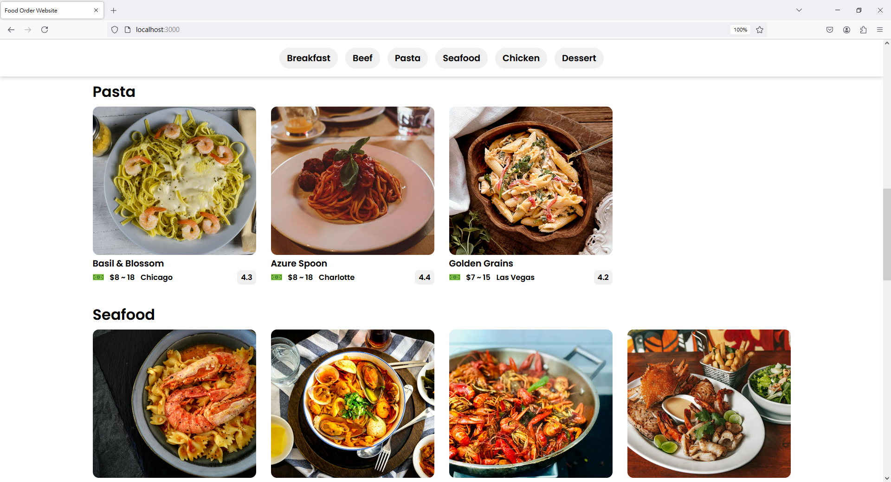
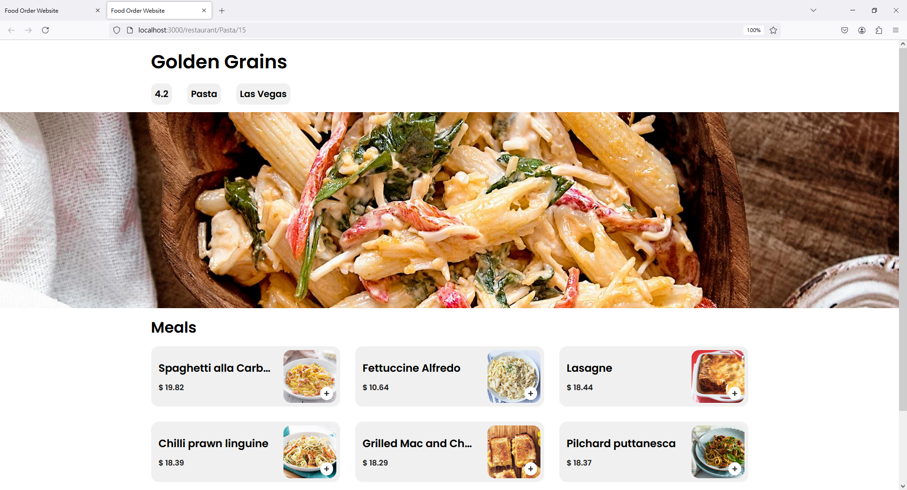
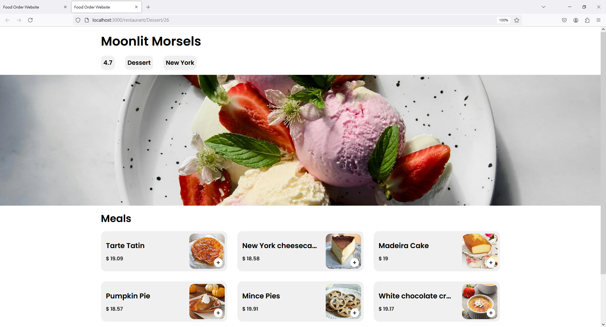
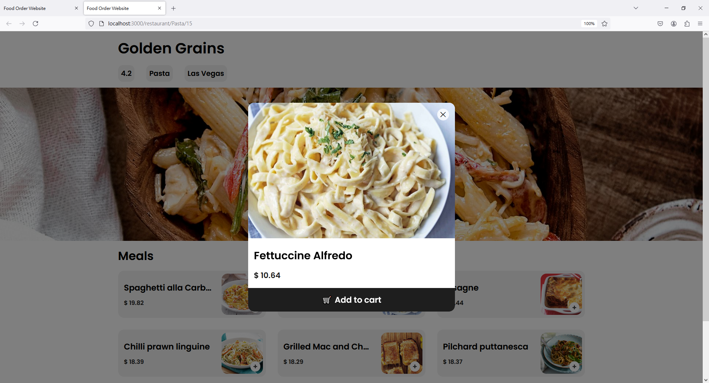
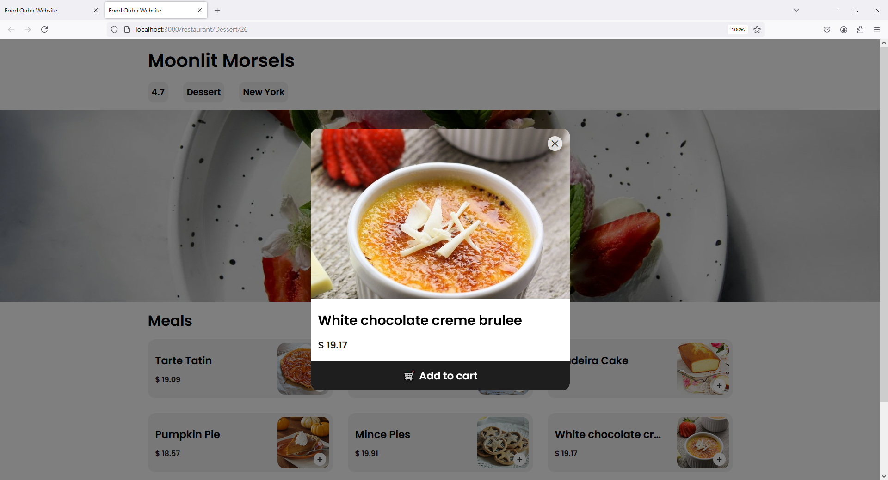

# 食物訂購網站 🍔

「食物訂購網站」讓使用者能夠輕鬆瀏覽多家餐廳的菜單並進行訂購。

## 專案截圖 📷

### 主頁面

使用者可查看按類別劃分的所有餐廳，並點擊餐廳進入詳情頁面

### 餐廳詳情頁面

顯示餐廳的基本資訊，包括評分、食物類型、地點以及圖片。使用者可以瀏覽完整菜單並選擇餐點

### 餐點詳情

點擊特定餐點後，顯示該餐點的完整名稱、價錢，並設有「加入購物車」按鈕

## 資料來源 🍴

本網站所使用之餐廳資料皆為虛構，名稱由 AI 生成。餐廳圖片來自 [Pexels](https://www.pexels.com/)，食物資料來自 [The Meal DB](https://www.themealdb.com/)。
